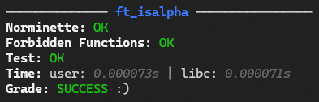

<p align="center">
  
  <br><a href="https://discord.gg/hVr9nDFwgY"></a>
  
  
  
  
  
</p>


libtest is a command-line utility designed to test the functions provided in the libft library.
It includes options to test mandatory and bonus functions, display available functions, and provide version information.

## Features
- Check if the Makefile and libft.h exists
- Check Makefile targets
- Check compilation flags
- Check norme errors
- Check forbidden functions
- Check memory leaks

## Installation
- Ensure you have a Makefile in your libft containing the targets `all`, `re`, `bonus`, `clean`, and `fclean`.
- Clone the repository into your libft folder using the following command:
```bash
git clone git@github.com:FonWasH/libtest.git
```
Make sure your environment is properly configured before proceeding with the installation steps.

## Dependencies
- Norminette https://github.com/42School/norminette
- bc > `sudo apt install bc`
- libbsd > `sudo apt install libbsd-dev`

## Usage
```bash
  libtest [OPTION/FUNCTION]...

  -a, --all         test all functions
  -f, --force       test all functions without norme and forbidden functions check
  -m, --mandatory   test mandatory functions
  -b, --bonus       test bonus functions
  -s, --show        display all available functions
  -h, --help        display help and exit
  -v, --version     output version information and exit
```
  
## Examples
- `libtest ft_atoi` Test the ft_atoi function.
- `libtest -m` Test all mandatory functions.
<p align="left">
  
</p>